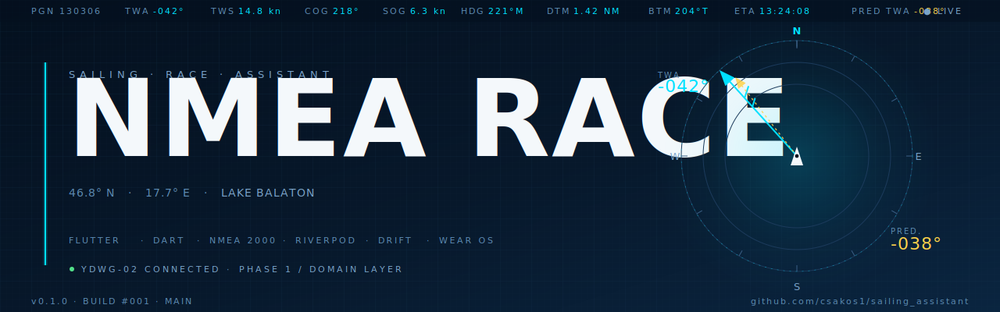

<p align="center">
  
</p>

<h1 align="center">NMEA Race</h1>

<p align="center">
  <strong>A real-time sailing race assistant for B&amp;G NMEA 2000 instruments.</strong><br/>
  Predicts the True Wind Angle at the next mark, so you can trim and steer before you round.
</p>

<p align="center">
  <a href="https://github.com/&lt;you&gt;/nmea-race/actions/workflows/ci.yml">
    
  </a>
  
  
  
  
  
  
  
  
  <br/>
  
  
  
  
</p>

<p align="center">
  <a href="#features">Features</a> ·
  <a href="#architecture">Architecture</a> ·
  <a href="#hardware">Hardware</a> ·
  <a href="#getting-started">Getting started</a> ·
  <a href="#development">Development</a> ·
  <a href="#roadmap">Roadmap</a> ·
  <a href="ARCHITECTURE.md">Full architecture →</a>
</p>

---

## Overview

**NMEA Race** is a Flutter-based race assistant that reads live data from B&amp;G
NMEA 2000 instruments through a [Yacht Devices YDWG-02](https://www.yachtd.com/products/web_gateway.html)
WiFi gateway, and computes — in real time — the racing metrics that mainstream
chartplotters don't surface well:

- The **predicted True Wind Angle at the *next* mark**, based on a rolling wind-shift trend.
- The bearing-to-mark, course-to-steer correction, distance, and ETA, all updated at ≥1 Hz.
- Auto mark-rounding detection, so the next leg is queued without touching the device.

The phone is the brain; the **Wear OS watch is the glanceable display** on deck.
The boat is the source of truth — position, heading, wind and speed come from
the marine instruments, not the phone GPS (battery first, but also: accuracy).

Everything is built around the assumption that **debugging on the water is impossible**.
Every meaningful calculation is replayable from recorded YDVR voyage data on the couch.

<sub>Currently a personal project, racing tour-style regattas on **Lake Balaton, Hungary**.
The architecture is built for extension; v1 is intentionally narrow.</sub>

---

## Features

### v1 — the racing screen

A fixed, glanceable layout. Six live values, updated continuously:

| # | Metric | Source | Rate |
|---|--------|--------|------|
| 1 | **True Wind Angle** | NMEA 2000 PGN 130306 (B&amp;G computed true wind) | 5–10 Hz |
| 2 | **Bearing to mark** | GPS position + mark coordinate (Haversine) | 1 Hz |
| 3 | **Course-to-steer correction** | bearing − COG / HDG | 1 Hz |
| 4 | **Distance to mark** | great-circle distance | 1 Hz |
| 5 | **ETA to mark** | distance / SOG | 1 Hz |
| 6 | **Predicted TWA at next mark** | TWD + rolling wind-shift trend + your future course | 1 Hz |

### Background features

- **Auto mark-rounding detection** — 50 m proximity threshold plus distance-receding heuristic, so you can't miss the rounding while focused on trim.
- **Wind shift trend tracking** — sliding-window linear regression on TWD with proper angle unwrapping (`359° → 1°` doesn't wreck the slope). Window length is a runtime setting (default 10 min).
- **Magnetic declination via the World Magnetic Model (WMM)** — dynamic, position-aware. No hardcoded constants drifting out of date.
- **Telemetry logger** — every NMEA frame and every computed value persisted, for post-race analysis and as training data for the v2 polar learner.
- **Warning system** — stale data, lost-fix, gateway disconnect, suspect-magnetic-heading, and similar conditions surface as banners. You don't act on bad data without knowing it's bad.
- **Race definition** — manual lat/lon entry, mark ordering, save and re-run.
- **Wear OS watch app** — downsampled state pushed over Wearable Data Layer. The watch is read-only, by design.

### Deliberately deferred (v2)

Polar support (CSV import + data-driven polar learning from your own telemetry archive), laylines, VMG / target speed, start-sequence countdown, configurable widget grid, multi-leg lookahead, multi-boat cloud sync. The architecture is shaped to receive these without rewrites.

---

## Architecture

Clean Architecture, four layers, dependencies always point inward.
The full document lives in **[`ARCHITECTURE.md`](ARCHITECTURE.md)** — that file is the project's north star.

```
┌─────────────────────────────────────────────────────────────┐
│  PRESENTATION  Flutter UI · Riverpod consumers · phone+watch│
└─────────────────────────────┬───────────────────────────────┘
                              │
┌─────────────────────────────▼───────────────────────────────┐
│  APPLICATION  Riverpod providers · stream merging · bridges │
└─────────────────────────────┬───────────────────────────────┘
                              │
┌─────────────────────────────▼───────────────────────────────┐
│  DOMAIN       Pure Dart · entities · use cases · interfaces │
└─────────────────────────────▲───────────────────────────────┘
                              │ implements
┌─────────────────────────────┴───────────────────────────────┐
│  DATA         NMEA TCP · PGN decoders · Drift · WMM · prefs │
└─────────────────────────────────────────────────────────────┘
```

**Principles enforced, not aspirational:**

- The `domain` package has **zero** Flutter, `dart:io`, or platform dependencies — it builds and tests on plain Dart, anywhere.
- Repositories are abstract interfaces in `domain`, implemented in `data`, swapped via Riverpod overrides in tests.
- Every calculation is a pure function or a deterministic stateful calculator, so the same recorded log always produces the same outputs.
- The NMEA parser, business logic, persistence, and UI never mix in one file.

---

## Tech stack

| Concern | Choice | Why |
|---|---|---|
| UI framework | Flutter (stable) | One codebase, phone + Wear OS |
| Language | Dart 3.6+ | Sealed classes, pattern matching, pub workspaces |
| State management | Riverpod 2.x | Compile-safe DI, override-for-test, streaming providers |
| Local DB | Drift (typed SQL) | Type-safe schema, isolate-based writes, painless migrations |
| Monorepo | Melos 7.x + Pub Workspaces | One repo, one CI, shared `domain` between phone and watch |
| Lints | `very_good_analysis` | Senior-level ruleset, strict-casts/inference/raw-types on top |
| Watch bridge | Wearable Data Layer (Kotlin) + method channel | Native APIs through a thin Flutter bridge |
| Geomagnetic | WMM model | Dynamic declination, position-aware |
| Testing | `test`, `flutter_test`, `mocktail` + replay logs | Domain unit tests + recorded-log integration tests |
| CI | GitHub Actions | Lint, format check, test on every push and PR |

---

## Hardware

### On the boat

| Component | Model | Role |
|---|---|---|
| Wind sensor | B&amp;G WS310 | AWA, AWS (10 Hz) |
| True wind / display | B&amp;G Triton2 | TWA / TWS calculation |
| Chartplotter | B&amp;G Vulcan 7R | SailSteer, polar storage (v2) |
| GPS + heading | B&amp;G ZG100 | Position, COG, SOG, magnetic heading |
| Speed / depth / temp | Simrad/Lowrance DST P617V | Boat speed through water |
| Backbone | Navico Micro-C | NMEA 2000 network |
| **Real-time gateway** | **Yacht Devices YDWG-02** | NMEA 2000 → WiFi TCP/UDP |
| **Voyage recorder** | **Yacht Devices YDVR** | `.DAT` log → replay source |

`.DAT` files from YDVR convert to YD RAW with the official *Voyage Data Reader*,
which is the same format the YDWG-02 streams over TCP — so the same parser
handles live races and replay-from-archive identically.

### Clients

- **Phone:** Google Pixel (Android).
- **Watch:** Samsung Galaxy Watch (Wear OS 3+).

> The watch is intentionally a **read-only secondary display**: it receives a
> downsampled, summarized state, never the raw NMEA stream. Battery and
> reliability over capability.

---

## Getting started

> Verified on Arch Linux. Other Linux distros work; macOS likely works; Windows
> not tested.

### Prerequisites

```bash
# Flutter SDK (stable channel)
git clone https://github.com/flutter/flutter.git -b stable ~/flutter
echo 'export PATH="$PATH:$HOME/flutter/bin"' >> ~/.bashrc

# JDK 17 for Android builds
sudo pacman -S jdk17-openjdk
sudo archlinux-java set java-17-openjdk

# Android SDK
yay -S android-sdk-cmdline-tools-latest android-platform android-sdk-build-tools
export ANDROID_HOME=$HOME/Android/Sdk
sdkmanager --install "platform-tools" "platforms;android-34" "build-tools;34.0.0"
sdkmanager --licenses

# Melos
dart pub global activate melos

flutter doctor -v   # everything green
```

### Clone and bootstrap

```bash
git clone https://github.com/csakos1/sailing-assistant
cd nmea-race
melos bootstrap          # resolves all packages in the workspace
```

### Run on a physical phone

```bash
# Pixel attached over USB, with USB debugging enabled
cd apps/phone
flutter run --release
```

### Run on a Wear OS watch

```bash
# Wireless ADB pair / connect first
adb pair <watch_ip>:<port>
adb connect <watch_ip>:<port>

cd apps/watch
flutter run --release
```

### Replay a recorded race (no boat required)

```bash
# Start the replay server — pretends to be a YDWG-02 over TCP
cd tools/nmea_replay
dart run bin/nmea_replay.dart \
  --input ../sample_logs/kekszalag_2024_leg1.ydraw \
  --speed 1.0 \
  --port 1457
```

Point the phone app at `localhost:1457` (or the dev machine's LAN IP) and the
full pipeline runs end-to-end on the couch.

---

## Project structure

```
nmea-race/
├── apps/
│   ├── phone/                 # Flutter app — phone
│   └── watch/                 # Flutter app — Wear OS, with Kotlin bridge
├── packages/
│   ├── domain/                # Pure Dart: entities, value objects, use cases, repository interfaces
│   ├── data/                  # NMEA parsers, Drift DB, WMM, settings — implementations
│   └── shared/                # Result<T,E>, extensions, constants
├── tools/
│   ├── nmea_replay/           # CLI: recorded log → fake YDWG-02 TCP server
│   ├── pgn_inspector/         # CLI: decode raw PGN dumps for debugging
│   └── sample_logs/           # Example NMEA logs for tests and demos
├── docs/
│   ├── nmea-pgn-reference.md  # Documentation of every PGN we consume
│   └── decisions/             # ADRs (Architecture Decision Records)
├── ARCHITECTURE.md            # The north star — read this first
└── README.md                  # You are here
```

---

## Development

### Daily commands

```bash
melos run analyze         # static analysis across the workspace
melos run format-check    # dart format --set-exit-if-changed
melos run test            # all tests in all packages
melos run gen             # build_runner for Drift, etc.
```

### Pre-commit hook

A pre-commit hook runs `analyze` and `format-check` locally before every commit:

```bash
git config core.hooksPath .githooks
chmod +x .githooks/pre-commit
```

### Commit convention

Conventional Commits, English subject line, body explains **what** and **why**:

```
feat(domain): add wind shift trend calculation with linear regression

- Add CalculateWindShiftTrend use case with sliding window approach
- Implement angle unwrapping to handle 359° → 1° transitions correctly
- Return WindShiftConfidence enum based on r² of regression

Foundation for predicted-TWA-at-next-mark. The 10 min default
window is configurable in settings for tuning during real races.
```

---

## Testing

| Layer | Approach | Coverage target |
|---|---|---|
| Domain | Pure unit tests; no mocking unless unavoidable | **≥ 95 %** |
| Data | Unit tests for PGN decoders against canboat sample frames; repository tests with in-memory Drift | ≥ 80 % |
| Application | Riverpod provider tests with overrides | ≥ 70 % |
| Presentation | Widget tests on critical screens; the rest is visual review | best effort |
| End-to-end | **Replay-based** integration: feed a recorded `.ydraw` log through the pipeline and assert computed outputs | every release-candidate phase |

The replay tests are the single most important quality gate: the boat is
rarely available, so every regression has to be catchable from a couch.

---

## Roadmap

| Phase | Scope | Outcome |
|---|---|---|
| 0 | Project skeleton, Melos, CI placeholder | Empty repo, green CI |
| 1 | Pure domain layer — every calculation + 95 %+ tests | The math is right before the hardware ever connects |
| 2 | NMEA 2000 parser, fast-packet assembler, PGN decoders, replay tool | A real YDVR `.DAT` plays through and produces clean domain entities |
| 3 | Phone app skeleton, raw NMEA viewer | Phone connects to YDWG-02 and shows the stream |
| 4 | Race definition + Drift persistence | Define a race, save it, re-open it |
| 5 | Home screen with all six widgets — v1 minimum | App is usable on the boat |
| 6 | Warning system | Bad data is visible, never silent |
| 7 | Wear OS app + Wearable Data Layer bridge | Phone in pocket, watch on the wrist |
| 8 | Post-race analysis: track, wind shifts, boat speed graphs | Learn from each race |
| 9 | On-water iteration | The list of v2 features writes itself |
| **v2** | Polar import + data-driven polar learning, laylines, VMG, start sequence | Tactical layer |

Estimate: **3–4 months to v1** at 10–15 hours / week. Two months if more.

---

## Contributing

This is a personal project for now — the primary user is the developer himself.
That said, if you race on Lake Balaton or run a similar B&amp;G + YDWG-02 setup
and want to try the app or compare notes, **open a discussion**. Bug reports
and PRs are welcome once v1 ships; see [`CONTRIBUTING.md`](CONTRIBUTING.md) for the
workflow (Conventional Commits, all checks green, one logical change per commit).

---

## License

License is not yet selected - see [issue #1](https://github.com/<you>/nmea-race/issues/1).
Until a license file is added, **all rights reserved by default**. If you want
to use any of this code, please open an issue.

---

## Acknowledgements

- **[canboat](https://github.com/canboat/canboat)** — the open NMEA 2000 PGN database. Every decoder in this project owes a debt to canboat's PGN definitions and sample data.
- **[Yacht Devices](https://www.yachtd.com/)** — for the YDWG-02 and YDVR, and for documenting the YD RAW format properly so developers can build on it.
- **[Signal K](https://signalk.org/)** — for setting the bar on what an open marine data ecosystem can look like.
- **[NOAA WMM](https://www.ncei.noaa.gov/products/world-magnetic-model)** — for the World Magnetic Model coefficients.
- The Lake Balaton sailing community — for showing why this app needs to exist.

---

<p align="center">
  <sub>Built for tour-race regattas on Lake Balaton ⛵</sub><br/>
  <sub>Flutter · Dart · NMEA 2000 · Clean Architecture · TDD</sub>
</p>
